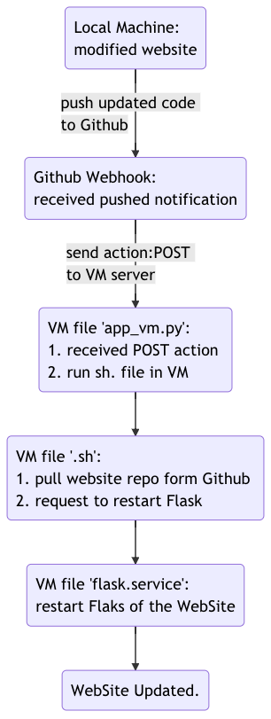

# Simple Flask WebSite
The website in this repo will be automatically deployed with its updates in a VM instance hosted on Google Cloud Platform, while the updates are pushed from a local machine.

## How it works


## Files in VM

### File: *app_vm.py*

```python
from flask import Flask, request
import subprocess

app = Flask(__name__)
@app.route('/', methods=['POST'])
def hello_world():
    subprocess.call(['/home/yuqi_tu/pullSimpleFlaskWebSite.sh'])
    return '{"status":"received"}'
if __name__ == '__main__':
    app.run()
```
* After the VM instance received the action [POST] from Github Webhook, then runs the function `hello_world`.
* Function `hello_world` calls the *.sh* file to run the actions specified in the file.  


### File: *updateGitRepoByWebhook.sh*

```sh
#!/bin/bash
cd /home/yuqi_tu/SimpleFlaskWebSite
git pull
sudo systemctl restart flask
```
* Firstly it pulls the repo from Github, then restarts Flask of the Website in the VM.


### File: *flask.service*

```service
Description=My Simple Flask Website
After=network.target
[Service]
User=root
ExecStart=/usr/bin/python3 -m flask run --host=0.0.0.0 --port=80
WorkingDirectory=/home/yuqi_tu/SimpleFlaskWebSite
#!/bin/bash
```
* While *.sh* requests to restart the Flask of the WebSite, the *.service* file executes the restart action.
