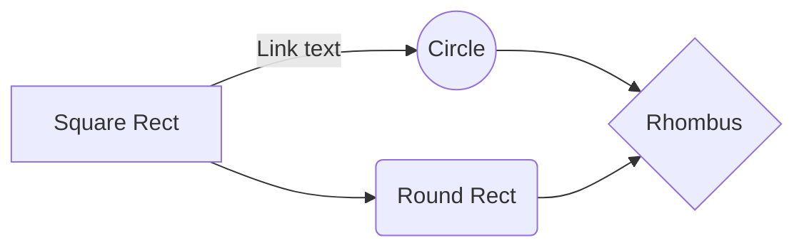

# Simple Flask WebSite
The website in this repo will be automatically deployed with its updates in a VM instance hosted on Google Cloud Platform, while the updates are pushed from local machine.

```mermaid
graph LR
    A[Square Rect] -- Link text --> B((Circle))
    A --> C(Round Rect)
    B --> D{Rhombus}
    C --> D
```
